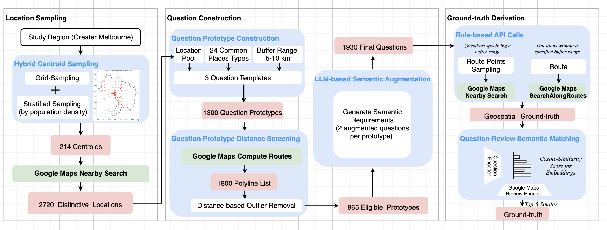
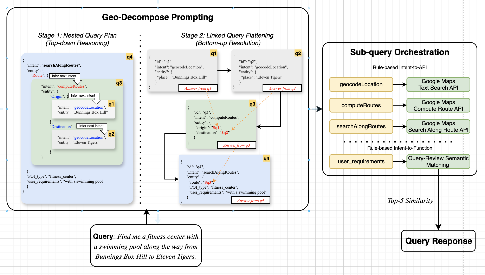
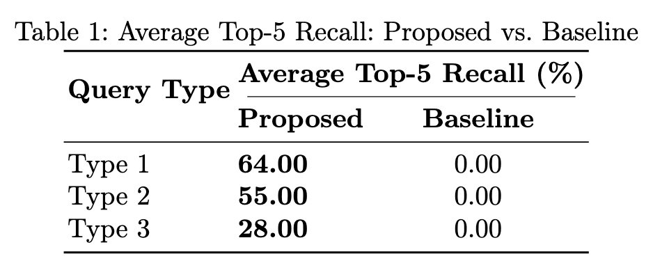
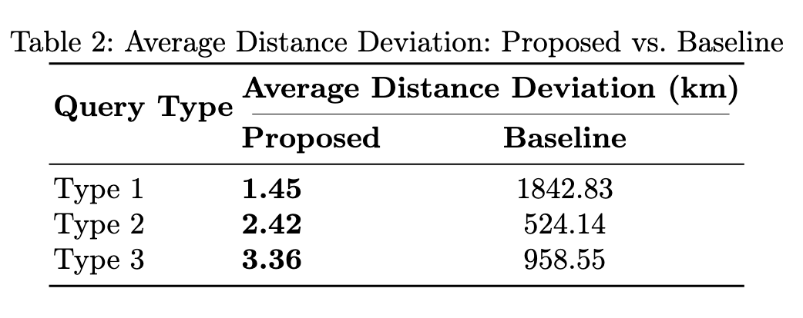
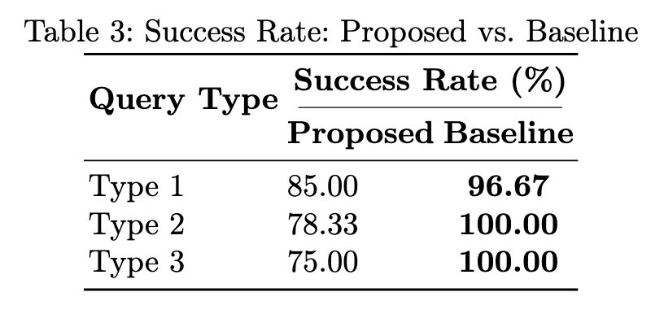
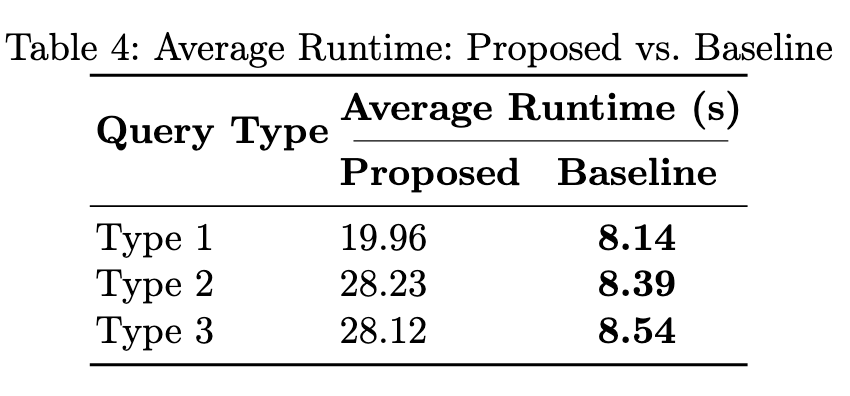

# LLM-Enhanced Processing for Complex Spatial Queries

This project aims to build an interpretable and tool-augmented LLM-based system for answering complex spatial queries. This repo contains the code implementation for:
  - A Melbourne-scale geospatial QA (Question-ansering) benchmark dataset built on Google Maps data.
  - A 2-stage LLM-planner for reliable, verifiable Complec Spatial Query (CSQ) decomposition.
  - A small-scale experiments (with 180 test queries) on the LLM-planner performance against our benchmark dataset.

## Dataset Generation Workflow
We employ a modular, scalable dataset generation workflow outlines as the follow:

### Location Sampling
We sample 2720 distinctive locations by carrying out hybrid (grid + stratified) sampling. Stratified sampling is based on population density, ensuring an alignment with real-word representation.

### Question Construction
We create 3 question templates:
  1. Find me a [POI] along the way from [Origin] to [Destination].
     
  2. Find me a [POI] along the way from [Origin] to [Destination], passing through [Waypoint].
     
  3. Find me a [POI] along the way from [Origin] to [Destination], within [Buffer_range]km of the route.
     
We then fill in the [Origin], [Destination] and [Waypoint] using the locations sampled from the previous module. For POIs, we randomly sampled from 24 common Google Maps places types. Buffer ranges are integers between 5 to 10km.

The filled-in prototypes are further semantically-augmented using an LLM.

### Ground-truth Derivation
Ground-truth are derived by;
  1. Geospatially, we call Google Maps APIs to obtain correct answers.
    
  2. Semantically, we computer cosine-similarity between query embedding and the embedding of google maps user reviews.

## System Architecture
We aim to guide our LLM planner to learn the reasoning steps for CSQ decompistion. This is achieved by few-shot prompting without any training. The objective of our system is to generate a set of ordered, correct and verifiable sub-queries with an input CSQ.

### Stage 1: Nested Query Planner
In the first stage, we demonstrate a top-down reasoning process. This is carried out by a specifically designed type of intent recognition, called Geospatial Intent Recognition (GIR). GIR requires the identification of:

  – intent: the purpose or action the user wants to perform
  
  – entity: the parameters required to accomplish the intent

### Stage 2: Nested Query Planner
This stage is to inearize the nested sub-queries back to a sequential, non-repeated list. This is achieved by a single prompt. Prompt in this stage involves a set of fixed instructions that asks the LLMs to:
  – Assign each sub-query with a unique "id".
  
  – Refer to previous sub-query outputs with "$id" instead of nesting.
  
  – List the most deeply nested sub-queries first, then proceed outward so only later items can reference earlier ones.
  
  – Remove any duplicated steps within the nested structure.Query: Identify all hospitals that are within 3 km of any school located within 500 m of the Yarra River

## Setup

### Prerequisite

1. Python 3.11 or higher
2. An venv with all required libraries installed
3. An access key to Google Maps API" `google_maps_api_key`
4. An access key  to OpenaI API: `openai_api_key`

### 1. Clone Repository
`git clone https://github.com/haoyeye5/COMP90055_Research_Project.git`

### 2. Environment Variables
Create a `.env` file in the root directory with the following keys:

openai_api_key=your_OPENAI_key

google_maps_api_key=your_GOOGLE_MAPS_key

### 3. Virtual Environment & Required Libraries

Run:

`python -m venv geoqa`

`source venv/bin/activate` 

`pip install -r requirements.txt`

### 4. Run Dataset Generation

Download the following open datasets from the Australian Beureau of Statistics (ABS):

  [1] Greater Capital City Statistical Areas - 2021 - Shapefile (url: https://www.abs.gov.au/statistics/standards/australian-statistical-geography-standard-asgs-edition-3/jul2021-jun2026/access-and-downloads/digital-boundary-files)

  [2] Population estimates by SA2, 2001 to 2024, GDA 2020, in GeoPackage  (url: https://www.abs.gov.au/statistics/people/population/regional-population/latest-release)
  
Create a folder: `raw`, put [1] and [2] into this folder. Create a folder: `curated`, at the same directory as `raw`. Put both folder in the same directory as the `notebook` folder.
Run all code blocks in `notebook/dataset_construction.ipynb`

### 4. Run LLM  Planner 
Run all code blocks in `notebook/system_implementation.ipynb`

### 5. Run Experiments
Run all code blok=cks in `notebook/experiment_graphs.ipynb`

## Experiments

### Benchmark Dataset Demo
The following map shows an instance in our benchmark dataset dataset. The query is: "Find me a fitness center with a swimmming pool along the way from Bunnings Box Hill to Elven Tigers.". The computed polyline in blue indicate an appropriate driving route from the origin to the destination. The 5 green landmarks serve as the ground truth to the query.

### Experiments Results
We evaluate our LLM Planner on 180 tests data from our benchmark dataset. Below are experiment results on 4 standard metrics:

   
   
